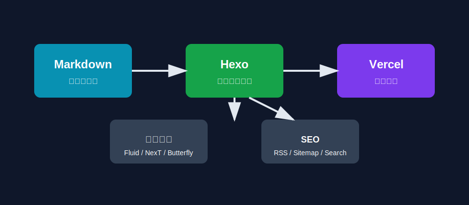

Hexo 的核心体验很简单：文章就是 Markdown 文件，图片就是静态资源，分类和标签写在文件顶部的 front-matter 里。

<!-- more -->

## 为什么用 Hexo

- 主题生态成熟，不必自己设计博客前台
- 写作流程轻，直接维护 Markdown 文件
- 静态站点部署简单，Vercel、GitHub Pages 都能跑
- 迁移成本低，文章天然就是 `.md`

## 插入图片

如果开启了 `post_asset_folder: true`，你可以给每篇文章建立同名资源目录：

```text
source/_posts/build-blog-with-hexo/
  architecture.png
```

然后在文章里这样引用：

```md

```

示例图片：


## 代码高亮

```ts
type Post = {
  title: string;
  tags: string[];
  content: string;
};

export function publish(post: Post) {
  return `${post.title} published`;
}
```

## 新建文章

```bash
npm run new:post "文章标题"
```

然后编辑 `source/_posts/文章标题.md` 即可。
